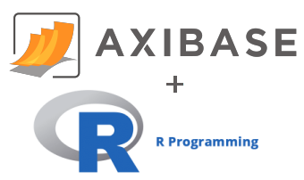

# ATSD R Package



## Table of Contents

* [Overview](#overview)
* [Installation](#installation)
* [Getting Started](#getting-started)
* [Uninstall](#Uninstall)
* [License](#license)
* [Examples](#examples)

---

## Overview

**ATSD R Package** enables R developers to communicate with  [Axibase Time Series Database](https://axibase.com/docs/atsd/); a non-relational clustered database for storing performance measurements from IT infrastructure resources such as servers, network devices, storage systems, and applications.

* `/source` directory contains package source code and documentation.
* `/compiled` directory contains binary packages for Linux and Windows as well as installation instructions.

### Connection Functions

Manage ATSD connection. Set up and store ATSD URL, username, and password. Configure cryptographic protocol and enforce SSL certificate validation when using HTTPS connection.

* [`show_connection()`](atsd_package.md#show_connection): Prints current values of the connection parameters. These values can differ from values in the [configuration file](./source/inst/connection.config).
* [`set_connection()`](atsd_package.md#set_connection): Overrides connection parameters for the duration of the current R session without changing the configuration file. If called without arguments, the function sets the connection parameters from the configuration file, otherwise `file` argument defines the `connection.config` file to use.
* [`save_connection()`](atsd_package.md#save_connection): Overrides connection parameters for the duration of the current R session without changing the configuration file.

> Refer to [Configure Connection](atsd_package.md#configure-connection) for more information.

### Package Functions

**ATSD R Package** provides functions for storing and retrieving time series and related meta data in ATSD:

* [`to_zoo()`](atsd_package.md#to_zoo) : Builds a [`zoo` object](http://cran.r-project.org/web/packages/zoo/index.html) from the given Data Frame.
* [`query()`](atsd_package.md#query): Retrieves historical time series data or forecasts from ATSD as a Data Frame object.
* [`get_metrics()`](atsd_package.md#get_metrics): Retrieves a list of metrics and associated tags from ATSD, and converts them to Data Frame object.
* [`get_entities()`](atsd_package.md#get_entities): Retrieves a list of entities and associated tags from ATSD, and converts them to a Data Frame object.
* [`get_series_tags()`](atsd_package.md#get_series_tags): Retrieves series tags for the defined metric and returns a Data Frame object. For each time series, the function enumerates tags and last update time associated with the series.
* [`save_series()`](atsd_package.md#save_series): Saves time series from a Data Frame into ATSD.

> For more information about package functions and their usage, refer to [Package Functions Documentation](atsd_package.md#functions).

---

## Installation

Stable release available via [CRAN](http://cran.r-project.org/web/packages/atsd/index.html).

```r
install.packages("atsd")
```

To install the alpha version from GitHub:

```r
install.packages("devtools")
library(devtools)
install_github("axibase/atsd-api-r/source")
```

`atsd` package depends upon the installation of the following packages:

* [`rcurl`](https://cran.r-project.org/web/packages/RCurl/index.html)
* [`httr`](https://cran.r-project.org/web/packages/httr/index.html)
* [`zoo`](https://cran.r-project.org/web/packages/zoo/index.html)

Review installed packages with the `library()` command.

To install required packages:

```r
install.packages(c("RCurl", "httr", "zoo"))
```

---

## Getting Started

Upon completion of package download, load the package into R to begin working with ATSD.

```r
library(atsd)
```

Review package documentation:

```r
help(package = "atsd")
```

Package [vignette](http://r-pkgs.had.co.nz/vignettes.html) contains detailed documentation and usage examples. View long-form documentation with `browseVignettes`:

```r
browseVignettes(package = "atsd")
```

For help with a particular function or package, use `?` syntax followed by the package name:

* `?atsd`
* `?set_connection`
* `?query`
* `?get_metrics`
* `?get_entities`

---

## Uninstall

To detach `atsd` from the current R session:

```r
detach("package:atsd", unload = TRUE)
```

To remove the package completely:

```r
remove.packages("atsd", .libPaths())
```

---

## License

**ATSD R Package** is licensed under the
[Apache License `2.0`](http://www.apache.org/licenses/LICENSE-2.0).

---

## Examples

* [Usage Examples](usage_example.md)
* [Forecast and Series Save Examples](forecast_and_save_series_example.md)

---
