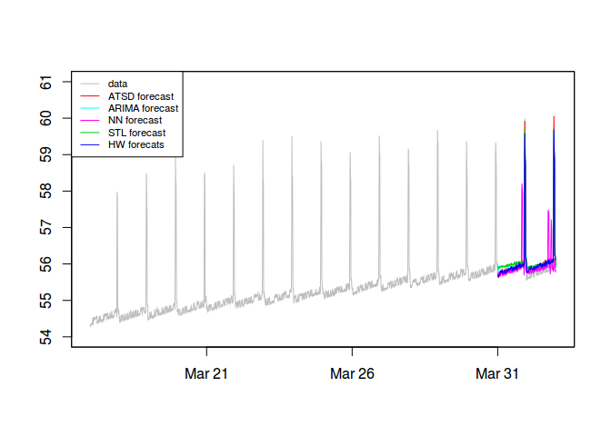
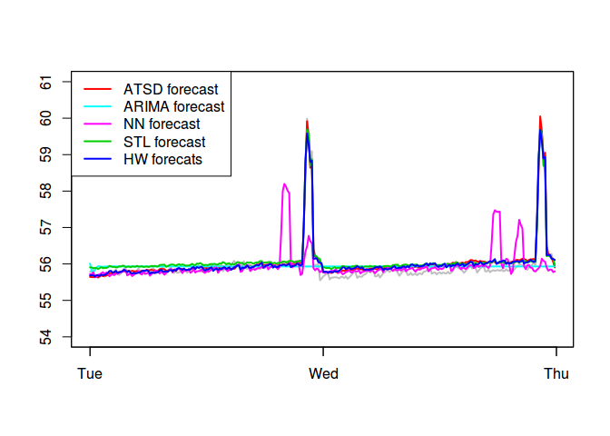
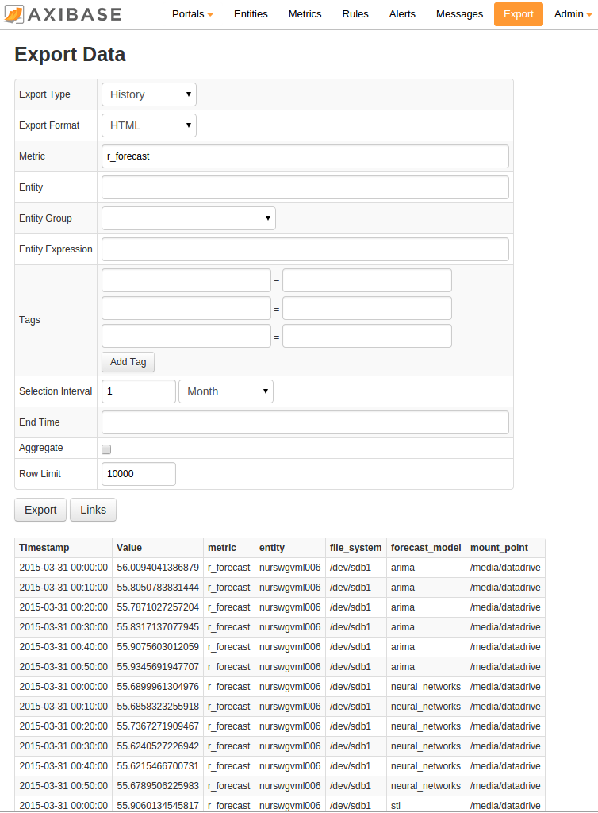
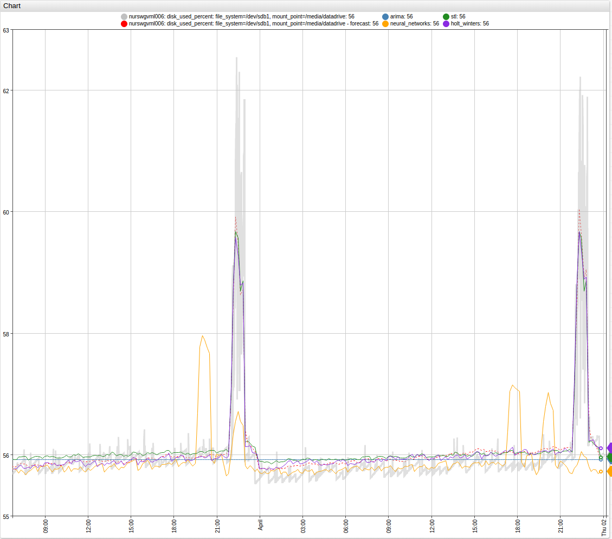
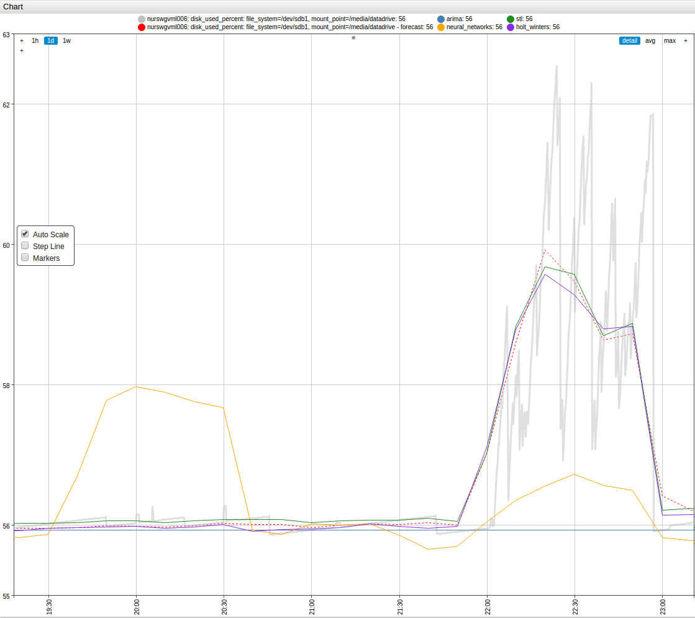

### Forecast and Save Series Example

-   Introduction
-   Establish connection with ATSD
-   Fetch data and forecast from ATSD, and then plot the retrieved data
-   Forecast with R
-   Compare predictions and save series into ATSD

### Introduction

In this demo we fetch time-series from ATSD. Then we forecast this time-series with the help of functions from the **stats** and **forecast** R packages. We then compare the generated forecasts with a forecast retrieved from ATSD and with real data for the same period. Finally, we save all forecasts in ATSD.

### Establish Connection with ATSD

Start by attaching the required packages to R.

``` r
require("atsd")
require("zoo")
require("stats")
require("forecast")
```

We store the ATSD url, user name, and password in a file. Then we can establish a connection with the ATSD server:

``` r
set_connection(file = "/home/user001/8_connection.txt")
```

### Fetch Data and Forecast from ATSD, then Plot the Retrieved Data

Let's first fetch the aggregated time-series for the given metric, entity, and tags from ATSD. Let us fetch data for the period of March 17 - April 1.

``` r
dup <- query(metric = "disk_used_percent", entity = "nurswgvml006",
             tags = c("file_system=/dev/sdb1", "mount_point=/media/datadrive"),
             selection_interval = "16-Day", end_time = "date('2015-04-02')",
             aggregate_interval = "10-Minute", aggregate_statistics = "Avg")
dup <- to_zoo(dup, value = "Avg")
```

We will use the first 2 weeks, March 17 - March 30, as a practice set to build prediction models. We will forecast the last two days, March 31 and April 1.

``` r
training_set <- window(dup, end = as.POSIXct("2015-03-30 23:50:00", origin="1970-01-01", tz="GMT"))
data_set <- window(dup, start = as.POSIXct("2015-03-31 00:00:00", origin="1970-01-01", tz="GMT"))
```

Firstly, we retrieve a 2 day forecast from ATSD. In this case ATSD, uses the Holt-Winters method to predict the behavior of the time-series.

``` r
atsd_forecast <- query(metric = "disk_used_percent", entity = "nurswgvml006",
                       tags = c("file_system=/dev/sdb1", "mount_point=/media/datadrive"),
                       selection_interval = "2-Day", end_time = "date('2015-04-02')",
                       aggregate_interval = "10-Minute", aggregate_statistics = "Avg",
                       export_type = "Forecast")
atsd_forecast <- to_zoo(atsd_forecast, value = "Avg")
```

We can view ATSD's forecast for the last two days and real data on the same graph.

``` r
# save timestamps for prediction period
time_stamps <- as.POSIXct(time(atsd_forecast), origin="1970-01-01", tz="GMT")
# graph time-series
plot(dup, xlim = c(start(dup), end(atsd_forecast)), ylim = c(54, 61), col = "grey", xlab = '', ylab = '')
# add ATSD forecast to graph
lines(atsd_forecast, col = "red")
legend("topleft", c("data", "ATSD forecast"), lty = 1, lwd = 1, col = c("grey", "red"))
```


### Forecast with R

We can build several models of the data with help of functions from the **stats** and **forecast** R packages.

``` r
# build ARIMA model with 'forecast' package
# fit best ARIMA model with auto.arima function from "forecast" package
arima_model <- auto.arima(training_set)

# to use other prediction models we need to convert zoo object to ts object
# 'frequency' parameter is number of measurements per day
training_ts <- ts(coredata(training_set), frequency = 6 * 24)

# Neural Network model with 'forecast' package
nn_model <- nnetar(training_ts, lambda = 0)

# STL model (Seasonal and Trend decomposition using Loess), the "stats" package
stl_model <- stl(training_ts, s.window = "periodic", robust = TRUE)

# build Holt-Winters model with "stats" package
hw_model <- HoltWinters(training_ts)
```

We use **helper** function to compute forecasts based on the built models, and convert results to zoo objects with the correct timestamps.

``` r
# Helper function, compute forecast from model
get_forecast <- function(model, ...) {
  # parameter h sets number of periods for forecasting
  forecast <- forecast(model, h = 2 * 24 * 6, ...)
  forecast <- as.zoo(forecast$mean)
  time(forecast) <- time_stamps
  forecast
}
```

Now we apply the helper function to the models.

``` r
arima_forecast <- get_forecast(arima_model)
nn_forecast <- get_forecast(nn_model)
stl_forecast <- get_forecast(stl_model, method="naive")
hw_forecast <- get_forecast(hw_model)
```

We can combine all forecasts and data on the same graph.

``` r
plot(dup, xlim = c(start(dup), end(dup)), ylim = c(54, 61), col = "grey", xlab = '', ylab = '')
lines(atsd_forecast, col = "red")
lines(arima_forecast, col = "cyan")
lines(nn_forecast, col = "magenta")
lines(stl_forecast, col = "green3")
lines(hw_forecast, col = "blue")
legend("topleft", 
       c("data", "ATSD forecast", "ARIMA forecast", "NN forecast", "STL forecast", "HW forecats"), 
       lty = 1, lwd = 1, cex = 0.7,
       col = c("grey", "red", "cyan", "magenta", "green3", "blue"))
```



To view more details, we can plot a graph for the last 2 days.

``` r
plot(data_set, xlim = c(start(atsd_forecast), end(atsd_forecast)), ylim = c(54, 61), 
     col = "grey", xlab = '', ylab = '', lwd = 2)
lines(atsd_forecast, col = "red", lwd = 2)
lines(arima_forecast, col = "cyan", lwd = 2)
lines(nn_forecast, col = "magenta", lwd = 2)
lines(stl_forecast, col = "green3", lwd = 2)
lines(hw_forecast, col = "blue", lwd = 2)
legend("topleft", 
       c("ATSD forecast", "ARIMA forecast", "NN forecast", "STL forecast", "HW forecats"), 
       lty = 1, lwd = 2, col = c("red", "cyan", "magenta", "green3", "blue"))
```



### Compare Predictions and Save Series into ATSD

We can calculate the difference between the forecasts and real data. Distances between two time-series can be calculated with functions implemented in the **TSdist** and **TSclust** R packages. We use the Euclidean distance as measure of dissimilarity.

``` r
require("TSclust")
diss.EUCL(coredata(data_set), coredata(atsd_forecast))
#>          x
#> y 2.593172
diss.EUCL(coredata(data_set), coredata(arima_forecast))
#>          x
#> y 10.79108
diss.EUCL(coredata(data_set), coredata(nn_forecast))
#>         x
#> y 11.4276
diss.EUCL(coredata(data_set), coredata(stl_forecast))
#>          x
#> y 3.113412
diss.EUCL(coredata(data_set), coredata(hw_forecast))
#>         x
#> y 2.54965
```

You can see that the Holt Winters method of the **stats** package gives a slightly better result than the Holt Winters method implemented in ATSD.

We can save the forecasts in ATSD.

``` r
r_forecasts <- list(arima = arima_forecast, neural_networks = nn_forecast, 
                    stl = stl_forecast, holt_winters = hw_forecast)
for (fcst in names(r_forecasts)) {
  dfr <- setNames(data.frame(index(r_forecasts[[fcst]]), coredata(r_forecasts[[fcst]]), 
                             row.names = NULL), c("Timestamp", "R_forecast"))
  save_series(dfr, metric_col = "R_forecast", entity = "nurswgvml006", 
              tags = c("file_system = /dev/sdb1", "mount_point = /media/datadrive", 
                       paste0("forecast_model = ", fcst)), verbose = FALSE)
}
```

Now forecasts are saved in ATSD and we can view them through the ATSD Export page, and view them in ATSD's charts.





View the above example in Chart Lab: 
[http://axibase.com/chartlab/01c588eb](http://axibase.com/chartlab/01c588eb)
