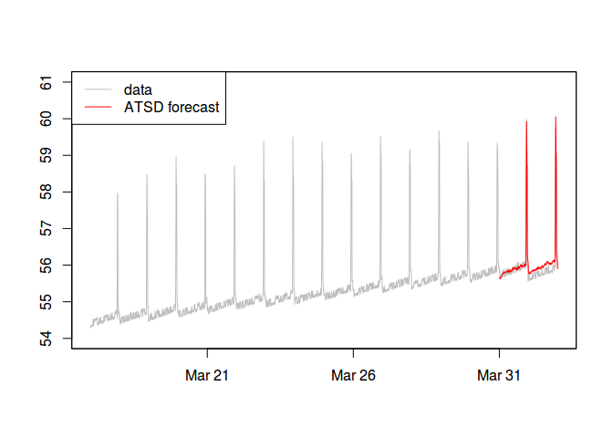
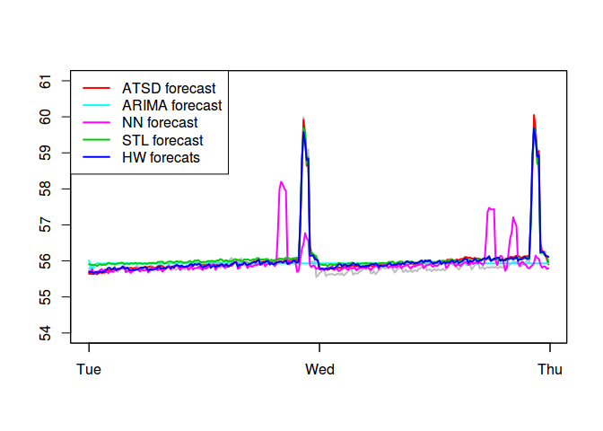
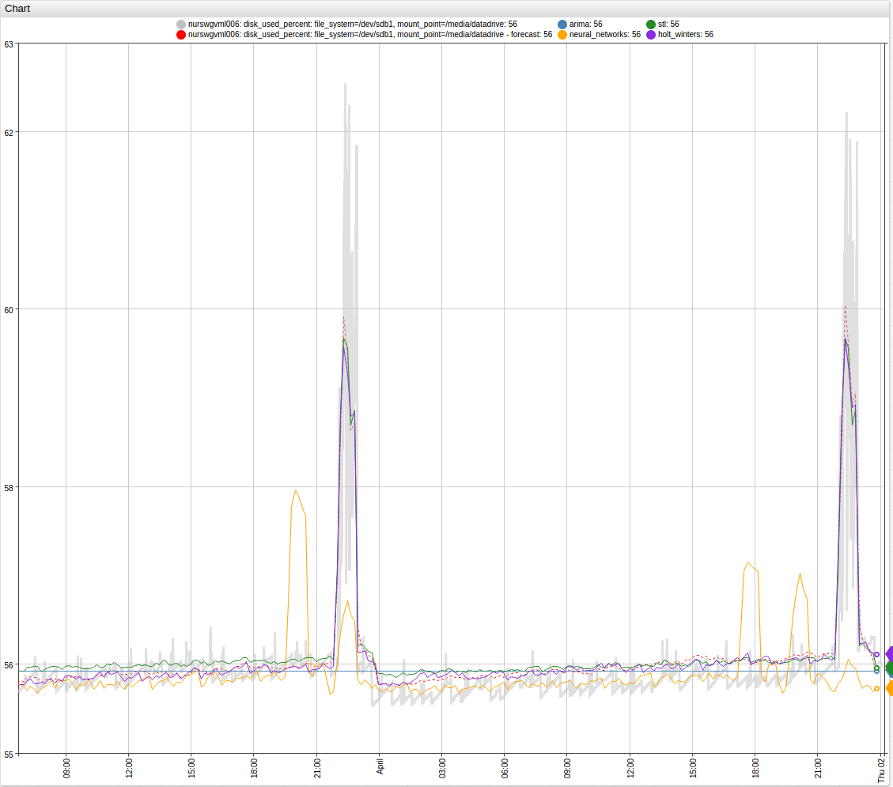
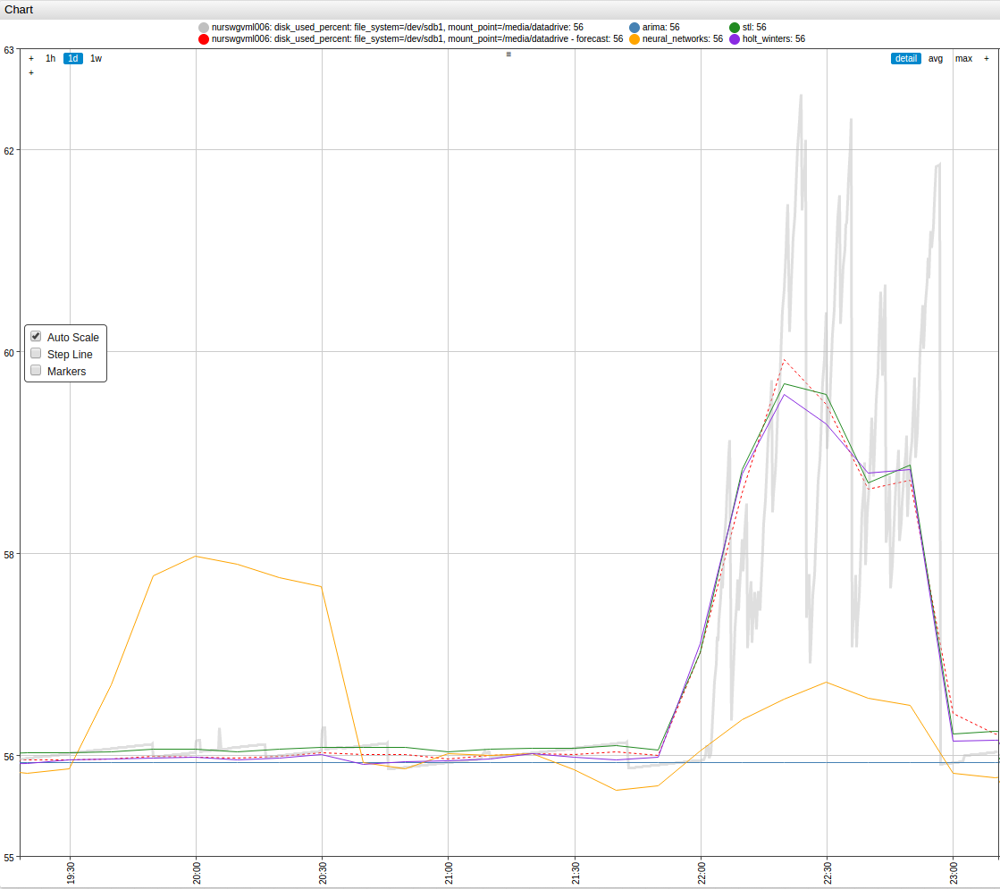

# Forecast and Save Series Example

* [Introduction](#Introduction)
* [Establish Connection with ATSD](#establish-connection-with-atsd)
* [Retrieve and Plot Data and Forecast from ATSD](#retrieve-and-plot-data-and-forecast-from-atsd)
* [Forecast with R](#forecast-with-r)
* [Compare Forecasts and Save Series into ATSD](#compare-forecast-and-save-series-into-atsd)

## Introduction

This tutorial demonstrates the process of retrieving data from ATSD and forecasting the future with the help of the [`stats`](https://stat.ethz.ch/R-manual/R-devel/library/stats/html/00Index.html) and [`forecast`](https://cran.r-project.org/web/packages/forecast/index.html) packages. The same samples are forecast with ATSD, and the results of the two forecasts compared to one another and actual data. Finally, both forecast series are stored in ATSD for future use.

## Establish Connection with ATSD

Begin by attaching the required packages to R.

```r
require("atsd")
require("zoo")
require("stats")
require("forecast")
```

Store the ATSD URL, username, and password in a `.txt` file then establish a connection with the ATSD server:

```r
set_connection(file = "/home/john_doe/8808_connection.txt")
```

### Retrieve and Plot Data and Forecast from ATSD

Retrieve aggregated time series for a metric collected by an entity with certain tags stored in ATSD during the period from March 17 to 30, 2015.

```r
dup <- query(metric = "disk_used_percent", entity = "nurswgvml006",
             tags = c("file_system=/dev/sdb1", "mount_point=/media/datadrive"),
             selection_interval = "16-Day", end_time = "date('2015-04-02')",
             aggregate_interval = "10-Minute", aggregate_statistics = "Avg")
dup <- to_zoo(dup, value = "Avg")
```

March 17 to 30, 2015 is used as training set data to build forecast models. Output forecast predicts series values for March 31 and April 1, 2015.

```r
training_set <- window(dup, end = as.POSIXct("2015-03-30 23:50:00", origin="1970-01-01", tz="GMT"))
data_set <- window(dup, start = as.POSIXct("2015-03-31 00:00:00", origin="1970-01-01", tz="GMT"))
```

Retrieve the two-day forecast from ATSD. Forecast is calculated with the [Holt-Winters](https://axibase.com/docs/atsd/forecasting/#algorithm-parameters) algorithm.

``` r
atsd_forecast <- query(metric = "disk_used_percent", entity = "nurswgvml006",
                       tags = c("file_system=/dev/sdb1", "mount_point=/media/datadrive"),
                       selection_interval = "2-Day", end_time = "date('2015-04-02')",
                       aggregate_interval = "10-Minute", aggregate_statistics = "Avg",
                       export_type = "Forecast")
atsd_forecast <- to_zoo(atsd_forecast, value = "Avg")
```

We can view ATSD's forecast for the last two days and real data on the same graph.

``` r
# Save timestamps for forecast period
time_stamps <- as.POSIXct(time(atsd_forecast), origin="1970-01-01", tz="GMT")
# Graph time series
plot(dup, xlim = c(start(dup), end(atsd_forecast)), ylim = c(54, 61), col = "grey", xlab = '', ylab = '')
# Add ATSD forecast to graph
lines(atsd_forecast, col = "red")
legend("topleft", c("data", "ATSD forecast"), lty = 1, lwd = 1, col = c("grey", "red"))
```



### Forecast with R

Build several models of the data with help of functions from the `stats` and `forecast` R packages.

```r
# Build ARIMA model with 'forecast' package
# Fit best ARIMA model with auto.arima function from "forecast" package
arima_model <- auto.arima(training_set)

# To use other forecast models convert zoo object to ts object
# 'frequency' parameter is number of measurements per day
training_ts <- ts(coredata(training_set), frequency = 6 * 24)

# Neural Network model with 'forecast' package
nn_model <- nnetar(training_ts, lambda = 0)

# STL model (Seasonal and Trend decomposition using Loess), the "stats" package
stl_model <- stl(training_ts, s.window = "periodic", robust = TRUE)

# Build Holt-Winters model with "stats" package
hw_model <- HoltWinters(training_ts)
```

Use function `helper` to compute forecasts based on constructed models and convert results to `zoo` objects with correct timestamps.

```r
# Helper function, compute forecast from model
get_forecast <- function(model, ...) {
  # parameter h sets number of periods for forecasting
  forecast <- forecast(model, h = 2 * 24 * 6, ...)
  forecast <- as.zoo(forecast$mean)
  time(forecast) <- time_stamps
  forecast
}
```

Apply `helper` function to the constructed models.

``` r
arima_forecast <- get_forecast(arima_model)
nn_forecast <- get_forecast(nn_model)
stl_forecast <- get_forecast(stl_model, method="naive")
hw_forecast <- get_forecast(hw_model)
```

Combine all forecasts and data on the same graph.

``` r
plot(dup, xlim = c(start(dup), end(dup)), ylim = c(54, 61), col = "grey", xlab = '', ylab = '')
lines(atsd_forecast, col = "red")
lines(arima_forecast, col = "cyan")
lines(nn_forecast, col = "magenta")
lines(stl_forecast, col = "green3")
lines(hw_forecast, col = "blue")
legend("topleft", 
       c("data", "ATSD forecast", "ARIMA forecast", "NN forecast", "STL forecast", "HW forecats"), 
       lty = 1, lwd = 1, cex = 0.7,
       col = c("grey", "red", "cyan", "magenta", "green3", "blue"))
```


To view more details, can plot a graph for the final two days.

```r
plot(data_set, xlim = c(start(atsd_forecast), end(atsd_forecast)), ylim = c(54, 61), 
     col = "grey", xlab = '', ylab = '', lwd = 2)
lines(atsd_forecast, col = "red", lwd = 2)
lines(arima_forecast, col = "cyan", lwd = 2)
lines(nn_forecast, col = "magenta", lwd = 2)
lines(stl_forecast, col = "green3", lwd = 2)
lines(hw_forecast, col = "blue", lwd = 2)
legend("topleft", 
       c("ATSD forecast", "ARIMA forecast", "NN forecast", "STL forecast", "HW forecats"), 
       lty = 1, lwd = 2, col = c("red", "cyan", "magenta", "green3", "blue"))
```



### Compare Forecasts and Save Series into ATSD

Calculate the difference between forecast and actual data. The distances between two time series is calculated with functions implemented in the [`TSdist`](https://cran.r-project.org/web/packages/TSdist/index.html) and [`TSclust`](https://cran.r-project.org/web/packages/TSclust/index.html) R packages. Use Euclidean distance as a measure of dissimilarity.

```r
require("TSclust")
diss.EUCL(coredata(data_set), coredata(atsd_forecast))
#>          x
#> y 2.593172
diss.EUCL(coredata(data_set), coredata(arima_forecast))
#>          x
#> y 10.79108
diss.EUCL(coredata(data_set), coredata(nn_forecast))
#>         x
#> y 11.4276
diss.EUCL(coredata(data_set), coredata(stl_forecast))
#>          x
#> y 3.113412
diss.EUCL(coredata(data_set), coredata(hw_forecast))
#>         x
#> y 2.54965
```

Save the forecasts in ATSD.

```r
r_forecasts <- list(arima = arima_forecast, neural_networks = nn_forecast, 
                    stl = stl_forecast, holt_winters = hw_forecast)
for (fcst in names(r_forecasts)) {
  dfr <- setNames(data.frame(index(r_forecasts[[fcst]]), coredata(r_forecasts[[fcst]]), 
                             row.names = NULL), c("Timestamp", "R_forecast"))
  save_series(dfr, metric_col = "R_forecast", entity = "nurswgvml006", 
              tags = c("file_system = /dev/sdb1", "mount_point = /media/datadrive", 
                       paste0("forecast_model = ", fcst)), verbose = FALSE)
}
```

View saved forecasts on the **Data > Export** page, and visualize series in [ATSD Charts](https://github.com/axibase/charts).




[](http://axibase.com/chartlab/01c588eb)
