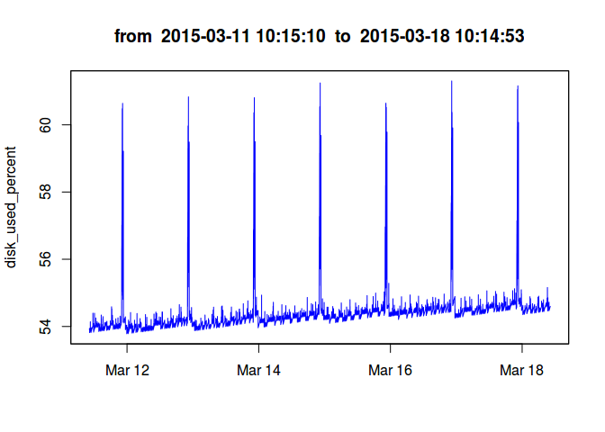
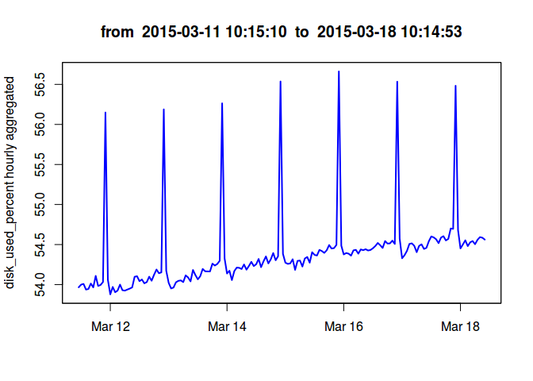
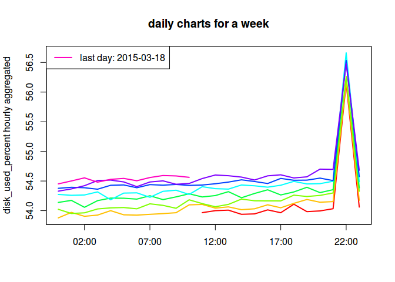
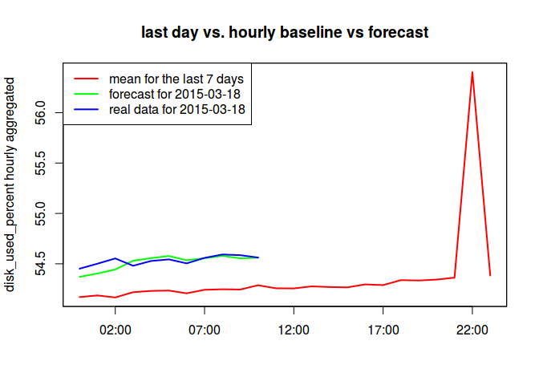

# Usage Example

* [Introduction](#introduction)
* [Establish Connection with ATSD](#establish-connection-with-atsd)
* [Define Time Series](#define-time-series)
* [Retrieve Time Series from ATSD](#retrieve-time-series-from-atsd)
* [Perform Aggregation](#perform-aggregation)
* [Parse Time Series by Day](#parse-time-series-by-day)
* [Compare Series, Baseline and Forecast](#compare-series-baseline-and-forecast)

## Introduction

Use **ATSD R Package** to manipulate time series as `zoo` objects in R. Define a metric for a time series collected by ATSD during a one week interval. Aggregate the time series using R and ATSD to compute an hourly baseline for the metric and compare the baseline with actual data and an ATSD forecast for the final day.

## Establish Connection with ATSD

Begin by attaching the required packages to R: [`atsd`](https://cran.r-project.org/web//packages/atsd/index.html), [`pander`](https://cran.r-project.org/web//packages/pander/index.html), and [`zoo`](https://cran.r-project.org/web//packages/zoo/index.html).

```r
require("atsd")
require("pander")
require("zoo")
```

Store ATSD URL, username, and password in a configuration file and establish connection to the ATSD server:

```r
set_connection(file = "/home/john_doe/8088_connection.txt")
```

## Define Time Series

Explore metrics which measure disk usage. Retrieve a list of metrics with `names like "disk"` from ATSD with the command:

```r
metrics <- get_metrics(expression = "name like '^disk*'")
#> Your request was successfully processed by server. Start parsing and filtering.
#> Parsing and filtering done. Start converting to data frame.
#> Converting to data frame done.
pandoc.table(metrics, style = "grid")
#> 
#> 
#> +-------------------+-----------+---------------------+---------------+--------------+
#> |       name        |  counter  |   lastInsertTime    |  tags.table   |    label     |
#> +===================+===========+=====================+===============+==============+
#> |     disk_free     |   FALSE   |         NA          |      NA       |      NA      |
#> +-------------------+-----------+---------------------+---------------+--------------+
#> | disk_free_percent |   FALSE   |         NA          |      NA       |      NA      |
#> +-------------------+-----------+---------------------+---------------+--------------+
#> |     disk_size     |   FALSE   | 2015-03-23 13:21:06 | Disk (script) |      NA      |
#> +-------------------+-----------+---------------------+---------------+--------------+
#> |     disk_used     |   FALSE   | 2015-03-23 13:21:06 | Disk (script) |      NA      |
#> +-------------------+-----------+---------------------+---------------+--------------+
#> | disk_used_percent |   FALSE   | 2015-03-23 13:21:06 | Disk (script) | Disk Used, % |
#> +-------------------+-----------+---------------------+---------------+--------------+
```

`disk_used_percent` is the desired metric. Retrieve the time series and tags collected for the metric, and view the results.

```r
time_series <- get_series_tags(metric = "disk_used_percent")
#> Your request was successfully processed by server. Start parsing and converting to data frame.
#> Converting to data frame done.
pandoc.table(head(time_series), style = "grid")
#> 
#> 
#> +--------------+---------------------+-------------------------------------+--------------------+
#> |    entity    |   lastInsertTime    |          tags.file_system           |  tags.mount_point  |
#> +==============+=====================+=====================================+====================+
#> | nurswgvml007 | 2015-03-23 13:20:54 | /dev/mapper/vg_nurswgvml007-lv_root |         /          |
#> +--------------+---------------------+-------------------------------------+--------------------+
#> | nurswgvml007 | 2015-03-23 13:20:54 |    10.102.0.2:/home/store/share     |     /mnt/share     |
#> +--------------+---------------------+-------------------------------------+--------------------+
#> | nurswgvml006 | 2015-03-23 13:20:58 | /dev/mapper/vg_nurswgvml006-lv_root |         /          |
#> +--------------+---------------------+-------------------------------------+--------------------+
#> | nurswgvml006 | 2015-03-23 13:20:58 |              /dev/sdb1              |  /media/datadrive  |
#> +--------------+---------------------+-------------------------------------+--------------------+
#> | nurswgvml003 | 2015-03-23 13:21:03 |              /dev/sdb1              |    /home/store     |
#> +--------------+---------------------+-------------------------------------+--------------------+
#> | nurswgvml003 | 2015-03-23 13:21:03 |               rootfs                |         /          |
#> +--------------+---------------------+-------------------------------------+--------------------+
```

Each table row describes a time series collected by ATSD. For example, the fourth row corresponds to a time series produced by the entity `nurswgvml006`  with tags `file\_system = /dev/sdb1`  and `mount\_point = /media/datadrive`. The last time a series update occurred is `2015-03-19 09:41:48`.

## Retrieve Time Series from ATSD

To get the time series for a one week period, make a request to ATSD:

```r
week <- query(metric = "disk_used_percent",
              entity = "nurswgvml006",
              tags = c("file_system=/dev/sdb1", "mount_point=/media/datadrive"),
              selection_interval = "1-week",
              end_time = "date('2015-03-18 10:15:00')")
#>
#> One of aggregate_interval or aggregate_statistics argument not provided to the function.
#> So data will be fetched without aggregetion.
#> If you need aggregation please specify both of aggregate_interval and
#> aggregate_statistics arguments.
#>
#>
#> Your request has succeeded. ATSD server response is: 200 OK.
pandoc.table(head(week, 3), style = "grid")
#>
#>
#> +---------------------+---------+-------------------+--------------+---------------+------------------+
#> |      Timestamp      |  Value  |      metric       |    entity    |  file_system  |   mount_point    |
#> +=====================+=========+===================+==============+===============+==================+
#> | 2015-03-11 10:15:10 |  53.91  | disk_used_percent | nurswgvml006 |   /dev/sdb1   | /media/datadrive |
#> +---------------------+---------+-------------------+--------------+---------------+------------------+
#> | 2015-03-11 10:15:25 |  53.92  | disk_used_percent | nurswgvml006 |   /dev/sdb1   | /media/datadrive |
#> +---------------------+---------+-------------------+--------------+---------------+------------------+
#> | 2015-03-11 10:15:40 |  53.92  | disk_used_percent | nurswgvml006 |   /dev/sdb1   | /media/datadrive |
#> +---------------------+---------+-------------------+--------------+---------------+------------------+
```

Exclude the tags from the time series, then convert the time series to a `zoo` object:

```r
ts <- to_zoo(week)
```

> Here, `ts` is short for time series.

Review the summary chart:

```r
summary(ts)
#>      Index                           ts       
#>  Min.   :2015-03-11 10:15:10   Min.   :53.78  
#>  1st Qu.:2015-03-13 04:14:52   1st Qu.:54.11  
#>  Median :2015-03-14 22:13:45   Median :54.31  
#>  Mean   :2015-03-14 22:14:19   Mean   :54.37  
#>  3rd Qu.:2015-03-16 16:13:32   3rd Qu.:54.47  
#>  Max.   :2015-03-18 10:14:53   Max.   :61.30
title <- paste0("from  ", as.character(start(ts)), "  to  ", as.character(end(ts)))
plot(ts, main = title, xlab = "", ylab = "disk_used_percent", col = "blue")
```



Determine if the time series is [regular](https://www.ibm.com/support/knowledgecenter/en/SSCRJU_3.2.1/com.ibm.swg.im.infosphere.streams.timeseries-toolkit.doc/doc/timeseries-regular.html).

```r
is.regular(ts, strict = TRUE)
#> [1] FALSE
```

## Perform Aggregation

Compare the last day of samples from the above series, March 18, 2015, with the hourly baseline for the week of March 11 to March 17, 2015. Aggregate the data in order to create a regular hourly spaced time series. Export aggregated series from ATSD or aggregate using functions in the `zoo` package. Both methods are performed here, and compared [below](#compare-series-baseline-and-forecast).

First, retrieve the aggregated time series from ATSD:

```r
ats <- query(metric = "disk_used_percent", 
            entity = "nurswgvml006",
            tags = c("file_system=/dev/sdb1", "mount_point=/media/datadrive"),
            selection_interval = "1-week",
            end_time = "date('2015-03-18 10:15:00')",
            aggregate_interval = "1-Hour",
            aggregate_statistics = "Avg")
#>
#> Your request has succeeded. ATSD server response is: 200 OK.
ats <- to_zoo(ats, value = "Avg")
```

Now, aggregate the initial time series `ts` with R:

```r
new_index <- as.POSIXct(trunc(time(ts), "hours"))
ats2 <- aggregate(ts, by = new_index, FUN = mean)
```

Compare `ats` and `ats2`:

```r
ats[1:5]
#> 2015-03-11 11:00:00 2015-03-11 12:00:00 2015-03-11 13:00:00 2015-03-11 14:00:00 2015-03-11 15:00:00 
#>            53.96615            53.99960            54.00836            53.93799            53.94511
ats2[1:5]
#> 2015-03-11 10:00:00 2015-03-11 11:00:00 2015-03-11 12:00:00 2015-03-11 13:00:00 2015-03-11 14:00:00 
#>            53.88623            53.96615            53.99960            54.00836            53.93798
```

`ats2` has an additional value at  `2015-03-11 10:00:00`, `value = 53.88623`.

Exclude the first value in `ats2` and compare the results:

```r
all(time(ats) == time(ats2[-1]))
#> [1] TRUE
max(abs(coredata(ats) - coredata(ats2[-1])))
#> [1] 2.211253e-07
```

All other values are near identical, what small differences do exist are close to zero.

Plot the aggregated time series.

> Note that the vertical range decreases.

```r
y_label <- "disk_used_percent hourly aggregated"
plot(ats, main = title, xlab = "", ylab = y_label, col = "blue", lwd = 2)
```



### Parse Time Series by Day

Break the time series `ats` apart into daily data and create a multivariate `zoo` object with a column for each day.

```r
first_day <- as.POSIXct(trunc(start(ats), "days"))
HOUR <- 60 * 60
ats <- merge(zoo(, seq(first_day, first_day + (8 * 24 - 1) * HOUR, by = HOUR)), ats)
ats <- aggregate(ats, function(x) {as.POSIXct(paste0("2015-03-18 ", substr(x, 12, 19)))},
                 FUN = function(x) {x})
```

View the resulting `zoo` object and associated chart:

```r
print(ats)
#>
#> 2015-03-18 00:00:00       NA 53.87805 54.02252 54.13851 54.27356 54.37668 54.32872 54.45166
#> 2015-03-18 01:00:00       NA 53.97078 53.95187 54.17292 54.25887 54.39392 54.36676 54.50093
#> 2015-03-18 02:00:00       NA 53.90453 53.96316 54.05644 54.26432 54.38639 54.42095 54.55313
#> 2015-03-18 03:00:00       NA 53.92508 54.02872 54.16885 54.31642 54.36160 54.50767 54.48067
#> 2015-03-18 04:00:00       NA 53.99978 54.04683 54.21199 54.18383 54.42780 54.51514 54.52800
#> 2015-03-18 05:00:00       NA 53.92975 54.05237 54.20945 54.29603 54.43375 54.48444 54.54382
#> 2015-03-18 06:00:00       NA 53.92452 54.03105 54.19438 54.30023 54.38616 54.40491 54.50434
#> 2015-03-18 07:00:00       NA 53.93780 54.11522 54.25115 54.22527 54.43919 54.48356 54.55868
#> 2015-03-18 08:00:00       NA 53.94997 54.08903 54.18609 54.32590 54.42972 54.50258 54.59240
#> 2015-03-18 09:00:00       NA 53.96509 54.03998 54.23212 54.34455 54.44169 54.44535 54.58560
#> 2015-03-18 10:00:00       NA 54.09775 54.18268 54.28425 54.27340 54.42599 54.45857 54.56198
#> 2015-03-18 11:00:00 53.96615 54.10452 54.11881 54.23105 54.40429 54.43216 54.54145       NA
#> 2015-03-18 12:00:00 53.99960 54.04249 54.06603 54.25416 54.37095 54.45385 54.60125       NA
#> 2015-03-18 13:00:00 54.00836 54.06381 54.10533 54.32030 54.36319 54.48182 54.58916       NA
#> 2015-03-18 14:00:00 53.93799 54.01601 54.19543 54.21762 54.43320 54.51994 54.56603       NA
#> 2015-03-18 15:00:00 53.94511 54.03119 54.16641 54.29006 54.41900 54.49171 54.51734       NA
#> 2015-03-18 16:00:00 54.01284 54.09878 54.16434 54.35169 54.39600 54.45768 54.58707       NA
#> 2015-03-18 17:00:00 53.96512 54.04840 54.16428 54.26477 54.42859 54.54358 54.60439       NA
#> 2015-03-18 18:00:00 54.10864 54.12296 54.26135 54.31538 54.49386 54.51256 54.55150       NA
#> 2015-03-18 19:00:00 53.98315 54.18835 54.23843 54.39396 54.45052 54.51469 54.57044       NA
#> 2015-03-18 20:00:00 53.99535 54.14189 54.25714 54.30405 54.45554 54.54876 54.70045       NA
#> 2015-03-18 21:00:00 54.03241 54.15265 54.29814 54.35363 54.49582 54.50734 54.69607       NA
#> 2015-03-18 22:00:00 56.14941 56.18821 56.26381 56.53661 56.66231 56.53390 56.48320       NA
#> 2015-03-18 23:00:00 54.06050 54.17400 54.32740 54.38397 54.48619 54.57323 54.68118       NA
plot(ats, screens = 1, col = rainbow(8), main = "daily charts for a week",
     xlab = "", ylab = y_label, lwd = 2)
legend(x = "topleft", legend = "last day: 2015-03-18", lty = 1, lwd = 2, col = rainbow(8)[8])
```



## Compare Series, Baseline, and Forecast

Compute a baseline:

```r
baseline <- zoo(rowMeans(ats[, 1:7], na.rm = TRUE), time(ats))
```

Retrieve the forecast for the final day from ATSD:

```r
forecast <- query(metric = "disk_used_percent", 
                  entity = "nurswgvml006",
                  tags = c("file_system=/dev/sdb1", "mount_point=/media/datadrive"),
                  selection_interval = paste0(as.character(10 * 60 + 15), "-Minute"),
                  end_time = "date('2015-03-18 10:15:00')",
                  aggregate_interval = "1-Hour",
                  aggregate_statistics = "Avg",
                  export_type = "Forecast")
#>
#> Your request has succeeded. ATSD server response is: 200 OK.
forecast <- to_zoo(forecast, value = "Avg")
```

Now, compare the last day with the baseline and forecast:

```r
plot(merge(baseline, forecast, ats[, 8]), screens = 1, col = rainbow(3), lwd = 2,
     main = "last day vs. hourly baseline vs forecast", xlab = "", ylab = y_label)
legend(x = "topleft", lty = 1, lwd = 2, col = rainbow(3),
      legend = c("mean for the last 7 days", "forecast for 2015-03-18", "real data for 2015-03-18"))
```


